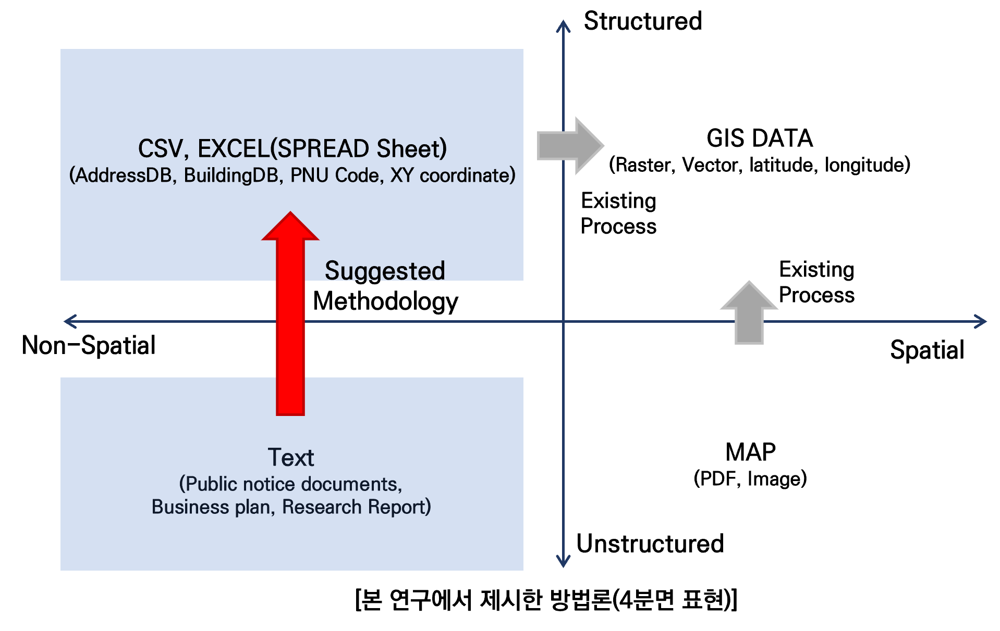

**[주의]** [개인 연구 기록 목적의 게시글로 비공개될 예정임]
{: .notice--danger}

**[정보]**[2022년 한국지리정보학회 추계학술대회 발표 내용]
{:.notice--info}

<br>

# AI 기반 문서 유형 분류 및 주소 추출

<br>

**연구를 진행할 때, 기록과 병행했어야 했는데, 거의 완성되어 갈 때즈음 정리하려니 머리 아프다.**

**기록을 습관적으로 하는 일상을 보내야겠다.**

<br>



<div class = "notice--warning">
<h4>연구 배경 및 목적</h4>
<ul>
    <li>다양한 분야에서 빅데이터 및 인공지능 기반의 공간정보서비스가 확대되고 있으며,
<br>그에 따라 공간의사결정을 위한 비공간 데이터의 수집 및 가공 방안에 대한 중요성이 강조되고 있음</li>
    <li>현재 정형-비공간/비정형-공간 데이터에서 GIS 데이터로의 변환은 가능하지만,
<br>비정형-비공간 데이터에서 공간 데이터 구축 시 어려움이 있음</li>
    <li>그리하여 본 연구에서는 문서 데이터에서 공간 데이터로 변환 가능한 구조화된 공간 요소(주소 정보를 포함한 문장)를 도출하는 방법론을 제시하는 데 목적이 있음</li>
</ul>
<h4>연구 절차</h4>
<ul>
    <li>연구 절차 1 : 기초 데이터의 문서 유형별 분류를 통한 공간 데이터의 주제도화</li>
    <li>연구 절차 2 : 문서에서의 주소 요소 추출을 통한 주소기반 공간 맵핑</li>
</ul>
</div>

<div class = "notice--success">
<h4>코드는 모두 모듈화하였으며, 구성은 다음과 같다.</h4>
<ul>
    <li>user_lib - 사전 정의 라이브러리</li>
    <li>config - 문서 유형 분류와 주소 정제를 위한 공통 환경 설정</li>
    <li>model - 문서 유형 분류와 주소 추출 및 검증에 활용할 모델</li>
    <li>classify_doc - 사전 정의 라이브러리 기반 문서 분류 훈련 및 테스트  </li>
    <li>address_Test - 사전 정의 라이브러리 기반 주소 훈련 및 테스트</li>
    <li>ner - 사전 정의 라이브러리 기반 개체명 인식</li>
    <li>bert_address_test_main - 구축한 BERT 기반 주소 검증</li>
    <li>bert_classify_main - 구축한 BERT 기반 유형 분류 검증</li>
    <li>bert_ner_main - 구축한 BERT 기반 개체명 인식 검증</li>
</ul>
</div>
<br>

**[주의]** 
[아래의 내용들은 작성된 코드들을 모듈화했기 때문에 순서에는 의미가 없음]
{: .notice--danger}


## 문서 유형 분류

### user_lib

#### def_chrome_drv.py

<br>

* 비정형-비공간 데이터인 문서 자료를 수집하기 위해 부산광역시 도시계획 고시공고문을 기초 데이터로 활용

* **Selenium**의 **Webdriver**를 활용하여 부산광역시 도시계획 고시공고문 게시글 내 첨부파일들을 자동 다운로드하기로 함
* 첨부파일을 데이터프레임 형식으로 불러오기 위해서는 첨부파일을 정형화하는 작업이 필요함
* 하지만 첨부파일이 txt 형식으로 제공되는 것이 아니라, hwp, pdf 또는 csv 형식으로 제공되는 경우도 있기 때문에
  Python에서 문서를 변환할 수 있는 Pyhwp 모듈을 활용하기로 함

<br>

**Selenium이란**

- 웹 사이트 내에서 **자동화**로 여러가지 동작 구현이 가능한 라이브러리로,
  <br>로그인 또는 **지속, 반복적인 검색**을 통해 데이터를 얻기에 적합함

<br>

Webdriver를 통해 외부 모듈에서 웹 브라우저를 제어할 수 있으며,

Chromedriver, Chrome, Selenium 모듈 설치 등과 같은 사전 환경설정이 필요함

[ChromeWebdriver](https://chromedriver.chromium.org/downloads){: .btn .btn--info}  [Chrome](https://www.google.co.kr/intl/ko/chrome/){: .btn .btn--info}

Python 내 Selenium 모듈 설치

```python
pip install selenium
```

<br>


ChromeWebdriver의 경우, 파이썬의 작업 환경에 해당하는 폴더에 같이 위치시키야 하며,
절대 경로로 지정해 주는 게 좋음

<br>

<br>

보통은 아래와 같은 코드를 작성해 Selenium의 Webdriver를 불러오지만,

본 연구에서는 문서 유형 분류, 주소 정제 및 개체명 인식에 작성한 코드들을 정리하기 


**1. Selenium Webdriver 활성화 및 다운로드 절대 경로로 설정하기 위한 라이브러리를 import**

```python
from selenium import webdriver
import chromedriver_autoinstaller
from selenium.webdriver.common.by import By
from selenium.webdriver.chrome.options import Options
import os
```

**2. Selenium Webdriver 활성화를 위한 홈페이지 특성에 따른 옵션을 부여할 필요가 있음**

```python
def get_drv(download_path):
    chromedriver = chromedriver_autoinstaller.install()
    chromeOptions = webdriver.ChromeOptions()
    chromeOptions.add_experimental_option('excludeSwitches', ['enable-logging'])
    prefs = {'download.default_directory' : os.path.abspath(download_path)}
    chromeOptions.add_experimental_option('prefs', prefs)
    driver = webdriver.Chrome(chromedriver, options = chromeOptions)    
    return driver
```


